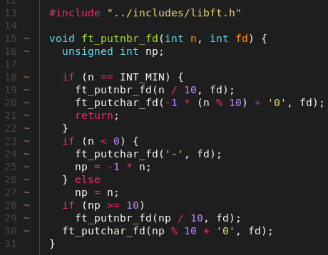

<h1 align=center>Libft</h1>
<p align="center">
  
</p>

<p align="center">
  
</p>

##  **📌 Description**
**Libft** est le premier projet du tronc commun à l'école 42. Il consiste à recréer une librairie C contenant des fonctions de base réimplémentées depuis zéro, ainsi qu'un ensemble de fonctions supplémentaires utiles pour les projets futurs.

Ce projet sert de fondation pour tous les autres projets en C du cursus 42.

## **🎯 Objectifs**
- Comprendre le fonctionnement des fonctions standards du C
- Apprendre à créer une bibliothèque statique
- Maîtriser l'allocation mémoire et la manipulation de chaînes
- Préparer une base de code réutilisable pour les projets suivants
- Respecter strictement la norme 42 (style de code)
- Réaliser un Makefile

## **📝 Fonctions à implémenter**

### Partie 1 - Fonctions Libc
Reproduction des fonctions de la libc du même nom privé du préfixe `ft_`.

`ft_isalpha` `ft_isdigit` `ft_isalnum` `ft_isascii` `ft_isprint` 
`ft_strlen` `ft_memset` `ft_bzero` `ft_memcpy` `ft_memmove` 
`ft_strlcpy` `ft_strlcat` `ft_toupper` `ft_tolower` `ft_strchr` 
`ft_strrchr` `ft_strncmp` `ft_memchr` `ft_memcmp` `ft_strnstr` 
`ft_atoi` `ft_calloc` `ft_strdup`

### Partie 2 - Fonctions supplémentaires

| Fonction | Description |
|-------------------|-------------|
| `ft_substr` | Alloue et retourne une sous-chaîne depuis `s` |
| `ft_strjoin` | Concatène `s1` et `s2` dans une nouvelle chaîne |
| `ft_strtrim` | Supprime les caractères de `set` au début/fin de `s1` |
| `ft_split` | Découpe `s` selon le caractère `c`, tableau de chaînes |
| `ft_itoa` | Convertit un entier `n` en chaîne de caractères |
| `ft_strmapi` | Applique `f` à chaque caractère de `s` avec son index |
| `ft_striteri` | Applique `f` à chaque caractère de `s` avec son index |
| `ft_putchar_fd` | Écrit le caractère `c` sur le file descriptor `fd` |
| `ft_putstr_fd` | Écrit `s` sur le file descriptor `fd` |
| `ft_putendl_fd` | Écrit `s` suivi d'un newline sur `fd` |
| `ft_putnbr_fd` | Écrit l'entier `n` sur le file descriptor `fd` |

### Bonus
Manipulation de listes chaînées.

`ft_lstnew` `ft_lstadd_front` `ft_lstsize` `ft_lstlast` 
`ft_lstadd_back` `ft_lstdelone` `ft_lstclear` `ft_lstiter` 
`ft_lstmap`

## **⚙️ Compilation & Utilisation**

### Installation
```bash
git clone git@github.com:acardona123/42_libft.git
cd 42_libft
make bonus
```

### Commandes Makefile
- `make` : compile la bibliothèque sans bonus
- `make bonus` : compile la bibliothèque avec bonus
- `make clean` : supprime les .o
- `make fclean` : supprime les .o et libft.a
- `make re` : recompile entièrement

### Utilisation dans votre projet
1. Ajouter `libft.a` et `libft.h` à votre projet
2. Inclure le header :
```c
#include "libft.h"
```
3. Compiler avec :
```bash
gcc -Wall -Wextra -Werror your_program.c -L. -lft
```


## Tests
Mon testeur libft est disponible sur GitHub:
[https://github.com/acardona123/42_tester_libft](https://github.com/acardona123/42_tester_libft)