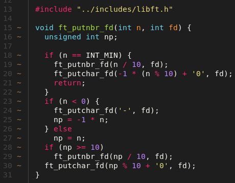

<h1 align="center">libft</h1>

<p align="center">
  
  
</p>

<p align="center">
  
</p>

<p align="center"><strong>A from-scratch C standard library: the string, memory, conversion and linked-list routines every later project builds on.</strong></p>

---

## 📌 Overview

Almost no C program is written without `strlen`, `memcpy`, `atoi` or a `malloc`-backed helper somewhere underneath it, and almost no one who calls them has looked at how they behave on an empty string, a null pointer or an overlapping copy. libft is the first project of the 42 common core and it closes that gap: reimplement that core by hand, ship it as a static library, and let the rest of the cursus depend on it.

The library has three parts. The first mirrors a set of `<ctype.h>`, `<string.h>` and `<stdlib.h>` functions under an `ft_` prefix, matching the originals down to their return values and edge cases. The second is a set of higher-level helpers the standard library does not provide: `ft_split`, `ft_strtrim`, `ft_substr`, `ft_itoa`, and the `ft_put*_fd` output functions. The bonus part adds a linked-list toolkit (`ft_lstnew`, `ft_lstadd_back`, `ft_lstmap` and the rest).

It compiles to `libft.a` through a Makefile that keeps the mandatory and bonus builds separate, and it is the dependency almost every other C project in this account links against.

## 🎯 Objectives

- Reimplement the libc functions faithfully, including their behaviour on empty strings, null pointers and overlapping memory.
- Build and manage a static library with a Makefile (`all`, `bonus`, `clean`, `fclean`, `re`, `.PHONY`).
- Handle manual allocation and string manipulation without leaks.
- Implement a small linked-list API for reuse in later projects.
- Keep every file within the 42 coding standard.

## 🛠️ Tech Stack

<p>
  
  
</p>

## 🚀 Getting Started

```bash
git clone https://github.com/acardona123/42_libft.git
cd 42_libft
make        # builds libft.a, mandatory functions only
make bonus  # same, plus the linked-list functions
```

## 📖 Usage

Add `libft.a` and the header to your project, include it, and link with `-lft`:

```c
#include "libft.h"

int main(void)
{
    char **words = ft_split("the quick brown fox", ' ');
    ft_putendl_fd(words[2], 1); // brown
    return (0);
}
```

```bash
cc main.c -L. -lft -I includes -o demo
```

<p align="center">
  
</p>

## 🧪 Tests

Validated against [42_tester_libft](https://github.com/acardona123/42_tester_libft), which runs the full mandatory function set and checks the build against the 42 norm.

## 📁 Structure

```
includes/libft.h   public header
src/               one file per function
src/bonus/         linked-list functions
test/              local test script
Makefile
```

## 📚 Resources

- [cppreference C standard library](https://en.cppreference.com/w/c/header)
- [Linux man pages: string operations](https://man7.org/linux/man-pages/man3/string.3.html)

---

<p align="center"><sub>🏫 Project from the <strong>42</strong> common core, School 42 Paris.</sub></p>
